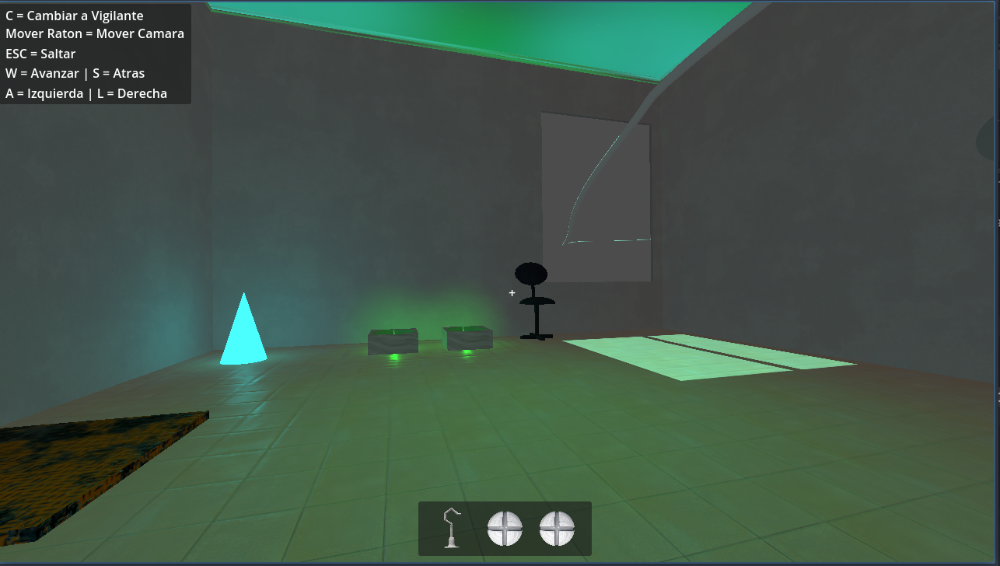
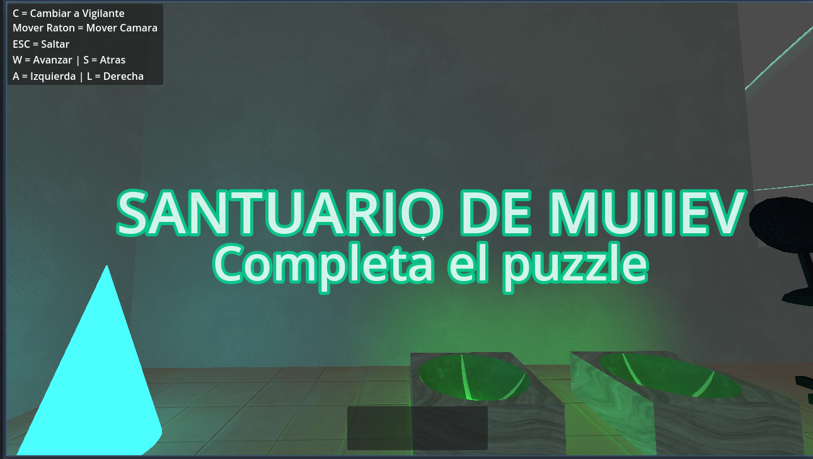
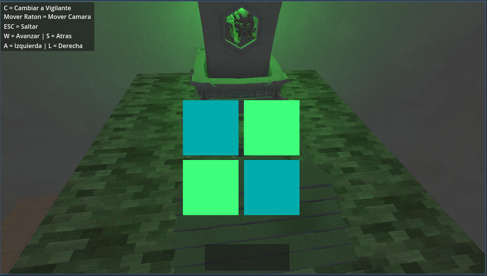
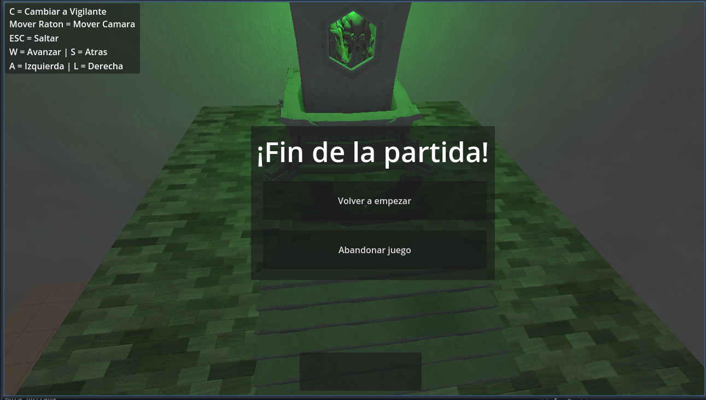
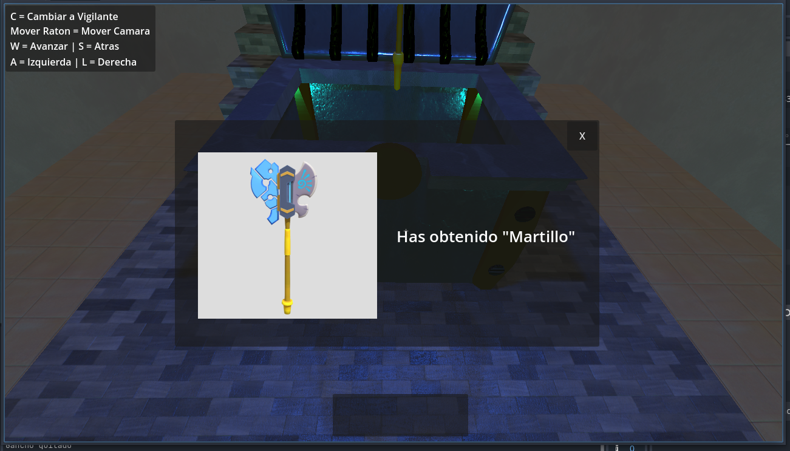
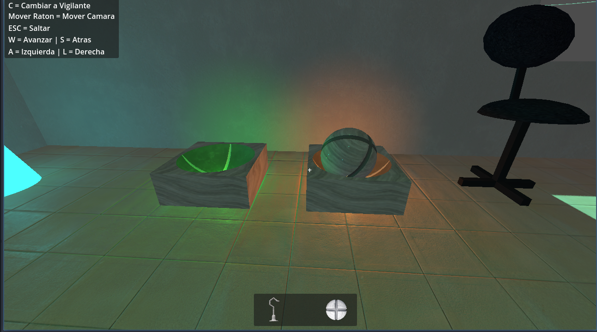
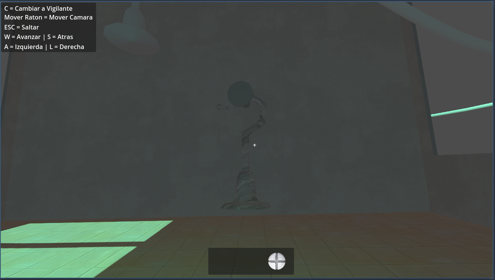
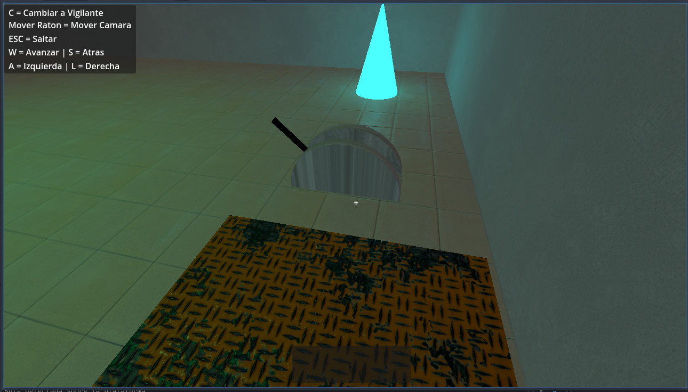
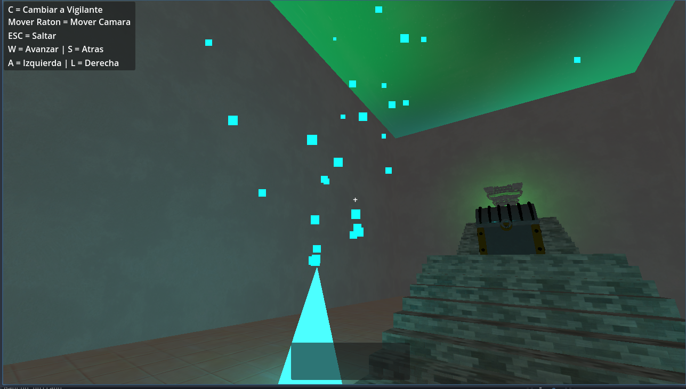

# Práctica 5 - Colisiones + Interacciones | Proyecto final
- Autor: Sergio Hervás Cobo 
- Asignatura: Entornos Virtuales - Master Universitario en Ingeniería Informática en la Universidad de Granada

## Colisiones
Se han añadido colisiones en todos los objetos del santuario:
- Las habitaciones son StaticBody
- Las plataformas, el cofre y demás objetos que no se planean mover, también son StaticBody
- Las bolas, el gancho y silla son RigidBody, que se podrán mover empujándolas con el Avatar. La silla tiene un RigidBody especial cambiando el punto de gravedad para que al moverla, no se caiga y se mueva como una silla en la realidad. 
- El avatar es un CharacterBody3D. Este podrá moverse por el mundo colisionando con los demás cuerpos, pero sus colisiones con otros objetos afectan gracias a la función del script "_physics_process". Puede mover objetos rígidos al colisionar con ellos, saltar e interactuar con otros cuerpos pulsando E. 
- El ascensor es un AnimatableBody3D (que hereda de StaticBody3D), debido a que se realizará una animación y su movimiento afectará a los cuerpos con los que colisione. 

## Carga de habitaciones
Se ha realizado la carga y descarga de habitaciones para mejorar el rendimiento cuando no se ven. Esto se ha hecho mediante dos áreas que detectarán si el jugador pasa a una habitacion o a otra. Se almacenan también las posiciones de los objetos rígidos "cogibles" (bolas y gancho) para que al volver, sigan en la posición donde estaban al descargar la habitación y, de esta forma, no hace falta volver a hacer el puzzle.

## Flujo del juego
El jugador debe coger las dos bolas (E) y lanzarlas sobre la plataforma (E). También cogerá el gancho (E) y lo lanzará (E) sobre el soporte de la pared trasera para que quede encajado. Una vez hecho esto, podrá ponerse sobre el ascensor y accionará la palanca (E). Cuando esta palanca suba, si espera 5 segundos, volverá a bajar a la habitación. Pero si continua, pasará a la segunda habitación, donde podrá coger el objeto del cofre pulsando E y finalizar la prueba del santuario pulsando E sobre el monumento al final de las escaleras. Deberá terminar el puzzle 2D clickando los dos botones azules para dejar los cuatro de color verde y acabará en la pantalla final.

## Extras
A continuación se especifican los añadidos extra que se han realizado para el santuario:
- **Sonidos:** Se han añadido sonidos para mejorar la inmersión en el juego.
    - **Inicio:** Al iniciar aparecen unas letras del título del santuario "MUIIEV" y un "Resuelve el puzzle" junto con un sonido.
    - **Palanca:** Al darle a la palanca, suena un sonido que puede ser:
        - **Error:** Si no están todas las piezas del puzzle
        - **Acierto:** Si están todas las piezas del puzzle, antes de que el ascensor ascienda por el pasillo.
    - **Cofre:** Al abrirlo, suena un sonido de obtención del objeto.
- **HUD e interfaces:** Se han añadido algunas interfaces para mejorar la interacción con el juego.
    - **HUD:** Interfaz que tiene el inventario, el cursor en el centro de la pantalla y los controles en la esquina superior izquierda.
    

    - **Start:** Letras con el título del santuario "MUIIEV" y un texto de "Resuelve el puzzle". Aparecen al inicio con un fade-in y se desvanecen con un fade-out a los pocos segundos.
    

    - **End:** Interfaz con el puzzle final que aparece al interactuar (E) con el monumento del santuario. Hay que presionar los dos botones azules para que se conviertan en verde y se pueda desbloquear el santuario. Cuando se realice, pasará a la pantalla final donde se puede abandonar el juego o reiniciarse.
    
    

    - **Cofre:** Interfaz cuando se interacciona (E) con el cofre. Muestra el objeto obtenido, hace un sonido y se ejecuta la animación del objeto saliendo. Además, también tiene un botón para cerrar la interfaz.
    

- **Inventario**: El usuario puede guardar hasta 3 objetos en su inventario. Podrá cambiar de objetos con los números del teclado (1, 2 o 3). Se ha decidido poner una imagen de los objetos en vez de un viewport como textura por simplicidad, pero tal y como se comentó en clase podría llevarse el objeto a una posición lejana con una cámara y "grabar" ese objeto. Cuando el objeto se suelta (E), desaparece del inventario.

- **Puzzle**: El usuario debe poner las bolas en las plataformas y el gancho sobre el soporte para poder activar la palanca y elevar el ascensor que lleva a la habitación final. En el caso de que no estén los 3 objetos puestos, la palanca emite un sonido y una animación de error.

- **Partículas:** Las runas de la habitación 2 tienen unas partículas quad con emisión que ascienden, simulando un efecto mágico.

- **Shaders**: Se han realizado unos shaders en el techo azules y verdes simulando una especie de niebla.
- **Restablecer objetos físicos**: Tal y como se plantea en el escenario, cuando una habitación se descarga y carga de nuevo, los objetos físicos vuelven a su posición inicial. En mi caso, he optado por almacenar el estado relevante de cada uno (posición y rotacion) y reestablecerlo cuando la habitación se vuelve a cargar.
- **Reinicio de juego:** El juego se puede reiniciar al finalizarse.
- **Salto del usuario:** El usuario puede saltar presionando espacio.
- **Mover objetos:** El usuario puede mover objetos empujándolos con ``apply_central_impulse``.
- **VR:** Se ha realizado la escena CameraXR para el uso en las gafas de realidad virtual siguiendo el tutorial que se dejó, pero por falta de medios y de tiempo no he podido comprobarlo. 