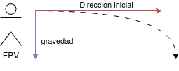

# 🎮 Lanzamiento de un Objeto desde Cámara en Primera Persona (FPV)
Sergio Hervás Cobo - EV Ejercicio 4.

Máster en Ingeniería Informática en la Universidad de Granada
## 1. Fuerzas fundamentales a considerar

- **Masa del objeto:** Importante para la resistencia al aire.
- **Fuerza inicial:** Dirección y magnitud del impulso desde la posición de la cámara. Determina la velocidad inicial y está aplicada en un ángulo determinado.
- **Gravedad:** Aceleración constante hacia abajo (`Vector3(0, -9.8, 0)`). Provoca la caída y la curvatura de la trayectoria.
- **Resistencia del aire:** Fuerza que se opone al movimiento, proporcional a la velocidad. Reduce el alcance y modifica la curva de la trayectoria. 𝐹𝑑 = −𝑘 * 𝑣.

## 2. Boceto de trayectoria desde FPV



## 3. Fórmulas del movimiento parabólico
- Posición horizontal: x(t) = v0.x * t
- Posición vertical: y(t) = v0.y * t - 1/2 * g * t²
- Velocidad horizontal: v.x(t) = v0.x (constante sin aire)
- Velocidad vertical: v.y(t) = v0.y - g * t

Donde:
- p0 es la posición inicial de la cámara.
- v0 es la velocidad inicial del objeto (dirección y fuerza de lanzamiento).
- g es la gravedad (aceleración, en este caso, [0,−9.8,0]).
- t es el tiempo transcurrido.

Con resistencia al aire utilizaríamos la fórmula que hay en las diapositivas de partículas. Fd​=−k⋅v


## 4. 💻 Pseudocódigo en Godot

```python
var gravedad = Vector3(0, -9.8, 0)
var coeficiente_aire = 0.1
var masa = 1.0
var fuerza_inicial = 20.0

# Estado del objeto lanzado
var posicion = Vector3.ZERO
var velocidad = Vector3.ZERO

func throw_object(camera_transform):
    # Inicializamos el lanzamiento desde la posición de la cámara
    posicion = camera_transform.origin
    velocidad = camera_transform.basis.z.normalized() * fuerza_inicial / masa

func _physics_process(delta):
    # Aplicamos la gravedad (irá cayendo en cada delta)
    velocidad += gravedad * delta
    
    # Aplicamos resistencia del aire
    var fuerza_aire = -coeficiente_aire * velocidad
    velocidad += fuerza_aire / masa * delta
    
    # Actualizamos la posición
    posicion += velocidad * delta
    
    # Movemos el objeto al suelo si se pasa
    if posicion.y < 0.0:  # Asumiendo que el suelo está en y=0
        posicion.y = 0.0
```